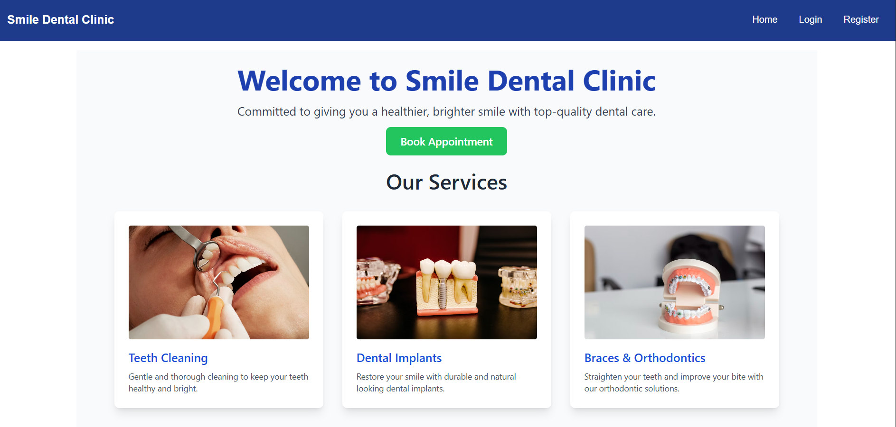

# 🦷 Dental Office Online Scheduling System

A full-stack dental appointment scheduling system built with React, Node.js, Docker, and Kubernetes — deployed on AWS using EKS, S3, and CloudFront.

---

### 🏠 Home Page  

### Demo  

---

## 🌐 Live Demo
- **HTTPS**
- **Frontend**: [https://d171usmdn2one3.cloudfront.net](https://d171usmdn2one3.cloudfront.net)
- **Backend API**: `not yet deployed, encountered problem for the free tier of aws` 

- **HTTP**
- **Frontend**: [http://dental-frontend-jmf.s3-website-us-east-1.amazonaws.com](http://dental-frontend-jmf.s3-website-us-east-1.amazonaws.com)
- **Backend API**: `http://af628dd5bb4904bc4aac6c6f3ffb272e-1608246877.us-east-1.elb.amazonaws.com/api/`
- **admin account**: `admin@gmail.com 12345`

---

### Architecture Overview

                 ┌──────────────────────┐
                 │  User Browser (HTTPS)│
                 └──────────▲───────────┘
                            │
                            ▼
            ┌────────────────────────────────┐
            │      AWS CloudFront (CDN)      │
            └──────────▲────────────▲────────┘
                       │            │
         ┌─────────────┘            └──────────────────────┐
         ▼                                                 ▼
┌─────────────────────┐                        ┌──────────────────────────────┐
│   S3 Static Bucket  │                        │   AWS Load Balancer (ALB)    │
│ dental-frontend     │  ← serves index.html   │ (via AWS Load Balancer Ctrl) │  ← ongoing fixing ( got bugs in free tier of aws)
└─────────────────────┘                        └─────────────┬────────────────┘
                                                             ▼
                                                ┌────────────────────────┐
                                                │ Kubernetes Service (LB)│
                                                └───────────┬────────────┘
                                                            ▼
                                                ┌──────────────────────┐
                                                │   Backend Pod        │
                                                │  Express + MongoDB   │
                                                └──────────────────────┘

---

## 🚀 Tech Stack

- **Frontend**: React, TailwindCSS
- **Backend**: Node.js, Express
- **Database**: MonggoDB Atlas
- **Deployment**: Docker, Kubernetes (EKS), S3, CloudFront
- **CI/CD**: GitHub + DockerHub (manual for now)
- **Security**: HTTPS via AWS ALB + ACM
- **Others**: SMTP Mailer, Nodemailer

---

## 📁 Project Structure
root/
├── client/ # React frontend
├── server/ # Node.js backend
├── k8s/ # Kubernetes manifests
├── eks-config # Backend config
└── README.md

---

## 🧪 Features

- Online appointment booking
- User/Admin dashboard 
- Real-time availability
- Secure API communication over HTTPS
- AWS-hosted scalable architecture

---

## API Endpoints
POST /api/auth/register                 - Register user
POST /api/auth/login                    - Login user
GET  /api/dentist                       - Get dentist list
GET  /api/dentists/count                - Count list of dentist
POST  /api/dentist/addDentist           - Create Dentist User
PUT  /api/users/:id                     - Update User Profile
GET  /api/users/count                   - Count list of user
GET  /api/appointments/count            - Count list of appointments
POST /api/appointments/book             - Book appointment
GET  /api/appointments                  - Get appointments
PUT  /api/appointments/:appointmentId   - Update appointment
DELETE /api/appointments/:appointmentId - Cancel appointment

---

## Deployment Steps
A. Frontend (Static)
    1. Build frontend:
        cd client
        npm run build
    2. Go to AWS S3 → create bucket dental-frontend
    3. Enabled static website hosting
    4. Upload contents of client/build/
    5. Select all uploaded file -> Action -> make public 

 Set up CloudFront:
    Origin: S3 Website Endpoint (not bucket URL)
    Viewer Protocol Policy: Redirect HTTP to HTTPS
    Cache: Only GET and HEAD
    Use ACM to issue HTTPS certificate and bind to CloudFront

B. Backend (EKS)
    1. Build and push docker
        docker build -t smiledental/dental-backend ./server
        docker push smiledental/dental-backend
    2. eksctl create cluster --name dental-cluster --region us-east-1 --nodes 2
    3. kubectl apply -f k8s/
    4. kubectl get svc dental-backend-service

## 🛠 Setup Instructions (Local Dev)

1. Clone & Install
git clone <repository-url>
cd medical-appointment-system

# Backend
cd server && npm install

# Frontend  
cd client && npm install
 
2. Run Application
# Terminal 1 - Backend
cd backend && nodemon index.js

# Terminal 2 - Frontend
cd frontend && npm start
